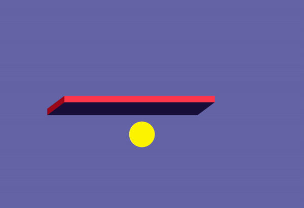

# bounce-a-ball

## 🛠 Tech Stack

 

## 🗂 Structure

```bash
┌── app.js
├── ball.js
├── block.js
├── index.html
└── style.css
```

## 👀



https://kimkyungmin123.github.io/bounce-a-ball/

## 📚

https://velog.io/@gyomni/%EA%B3%B5-%ED%8A%80%EA%B8%B0%EB%8A%94-%ED%99%94%EB%A9%B4-%EC%83%9D%EC%84%B1
